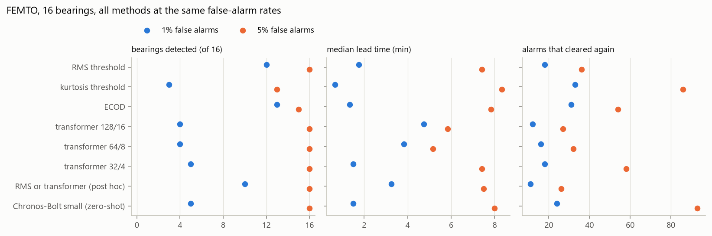
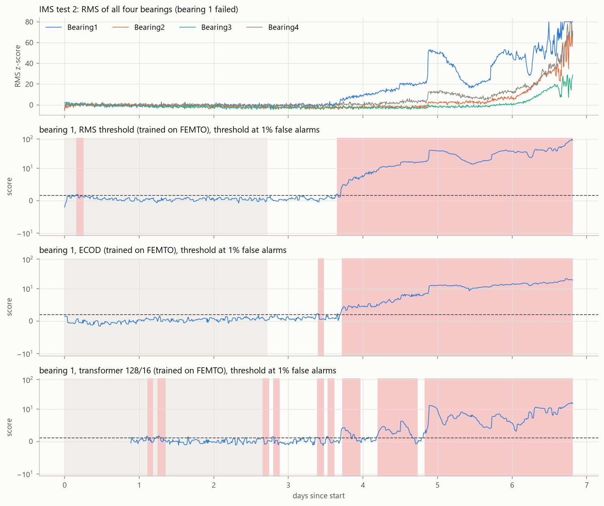

# Bearing Attention

A digital stethoscope for bearings: can a small forecasting transformer, trained only on healthy vibration data, notice bearing wear earlier than simple methods?

Demo: https://bearing-attention.streamlit.app

I trained a small PatchTST-style transformer to forecast vibration features of healthy bearings and used its forecast error as an anomaly score. I compared it with an RMS threshold, a kurtosis threshold and ECOD on the FEMTO/PRONOSTIA run-to-failure data, with every method set to the same false-alarm rate, and then applied the FEMTO-trained model to the NASA IMS data without retraining.

The short answer is no, not on this data. At a strict false-alarm rate (1 % of healthy time in alarm) the transformer catches 4 of 16 FEMTO failures before the end, against 12 for RMS and 13 for ECOD. At 5 % RMS, ECOD and the transformer catch 15 or 16 of the 16 failures, a few minutes ahead, and the transformer produces fewer alarms that switch themselves off again than ECOD. It reacts to changes in how a bearing vibrates rather than to slow growth, which helps on some bearings and hurts on others. On IMS the FEMTO model finds the failure about two days ahead; RMS and ECOD find it about three days ahead. A pretrained Chronos-Bolt model used without any training on bearings behaves much like my small transformer, only noisier, so the limit seems to be the forecast-error approach itself rather than the size of the model.



## Data

**FEMTO / PRONOSTIA** (IEEE PHM 2012 challenge). Accelerated life tests of ball bearings under three operating conditions (1800 rpm / 4000 N, 1650 rpm / 4200 N, 1500 rpm / 5000 N), two accelerometers at 25.6 kHz, one 0.1 s snapshot every 10 s. Things I found while loading the NASA archive:

- Besides the 6 learning bearings and the 11 truncated competition test records, the archive holds the full test records (`Validation_Set.zip` → `Full_Test_Set`). Their beginning is byte-identical to the truncated records, and for 10 of the 11 bearings the part after the cut is exactly the actual RUL published by the organizers. I use the full records and never the truncated ones for lead times.
- Bearing1_4 is the exception: its full record runs 2890 s past the cut while the published RUL is 339 s, so its end of life is unclear. It is only used as healthy training data.
- Two Bearing1_1 files carry a wrong time stamp (they jump to another time of day and back), so time is taken from the file order.
- The "20 g" criterion from the challenge document does not mark the end of the records: some bearings exceed 20 g early in life, others never reach it. I take the end of each record as the failure.

That leaves 16 bearings (6 learning + 10 full test) whose last snapshot is the failure. Their lives range from 230 to 2803 snapshots (38 min to 7.8 h).

**NASA IMS**, test 2 only: four bearings on one shaft, 2000 rpm, 20 kHz, one 1 s snapshot every 10 min for 6.8 days; bearing 1 ends with an outer race failure, bearings 2 to 4 do not fail. The last two files were recorded after the rig stopped (all channels near zero) and are dropped, which leaves 982 snapshots.

The data is free to use with a citation but may not be redistributed, so this repository only has a download script. Sources:

- P. Nectoux, R. Gouriveau, K. Medjaher, E. Ramasso, B. Morello, N. Zerhouni, C. Varnier. PRONOSTIA: An Experimental Platform for Bearings Accelerated Life Test. IEEE International Conference on Prognostics and Health Management, Denver, CO, USA, 2012. Data: "FEMTO Bearing Data Set", NASA Prognostics Data Repository, NASA Ames Research Center, Moffett Field, CA.
- J. Lee, H. Qiu, G. Yu, J. Lin, and Rexnord Technical Services (2007). IMS, University of Cincinnati. "Bearing Data Set", NASA Prognostics Data Repository, NASA Ames Research Center, Moffett Field, CA.

Both come from the PHM Society mirror of the NASA repository (https://data.phmsociety.org/nasa/, data sets 10 and 4).

## Features

For every snapshot and every accelerometer axis I compute 14 features, defined in Hz so that both datasets get exactly the same ones: RMS, peak, kurtosis, crest factor, the power in eight bands between 0 and 10 kHz (10 kHz is the Nyquist frequency of IMS), and two envelope features computed on the 2 to 9 kHz band: how strongly the envelope is modulated, and how much the highest line of the envelope spectrum stands out (periodic impacts, whatever their frequency).

The bearing defect frequencies (BPFO, BPFI, BSF) need the geometry. The FEMTO challenge document gives it (13 balls of 3.5 mm on a 25.6 mm pitch diameter; no contact angle, I use 0°, which moves BPFO by less than 1 Hz at the 10 Hz resolution of a 0.1 s snapshot even if the true angle were 15°). The IMS readme gives none, and I could only find the usual numbers in secondary sources, so I left defect frequencies out for IMS and out of all detectors; on FEMTO I use them for inspection only. As a check, the envelope spectrum of Bearing2_2 shows clear lines at 1, 2 and 3 times BPFO at the end of its life ([figure](results/figures/femto_envelope_Bearing2_2.png)).

Every bearing is normalized against its own start: a z-score of the log of each feature, built from the median and the MAD of its first 100 snapshots so that a short start-up transient does not inflate it. That is 16.7 min on FEMTO and 16.7 h on IMS, and uses nothing from later in the life.

For training and for counting false alarms I call the first 15 % of each FEMTO life healthy. No FEMTO bearing shows a sustained RMS change earlier; the earliest are Bearing2_1 (a step at 15 to 20 %) and Bearing2_2 (from about 25 %), see [RMS over life](results/figures/femto_rms_over_life.png). Inside that segment there are short transients (Bearing2_3, Bearing1_2), which are not wear but which the simple methods do react to, and they count as false alarms. On IMS the same rule gives 40 % of the test: bearing 1 starts to rise at about 52 %.

## Method

The forecaster is a small transformer in the spirit of PatchTST (Nie et al., "A Time Series is Worth 64 Words", ICLR 2023, arXiv:2211.14730), written from scratch in PyTorch ([model.py](src/bearing_attention/model.py)). Each feature series is handled on its own with shared weights (channel independence). The past window is cut into overlapping patches, each patch becomes a token, two self-attention layers mix the tokens (d_model 64, 4 heads, about 80k parameters), and a linear head forecasts the next snapshots. The window mean is subtracted before and added back after, so a slow drift of the level is not a surprise, but a more erratic signal still gives larger errors. I only use forecasting, not the masked-patch pre-training of PatchTST, which is a reconstruction task.

It is trained with MSE on windows taken from the healthy segments only, for 5 epochs (about one minute on a laptop CPU; the error on held-out bearings stops improving after one or two epochs). The anomaly score of a snapshot is the log of its squared forecast error, averaged over all the forecasts that predicted it and over the features, each feature's error divided by its typical healthy error (kurtosis is much harder to forecast than RMS). The score only uses past data.

I tried three window/patch sizes, all with 15 patches:

| variant | window | patch / stride | forecast | window on FEMTO | window on IMS |
|---|---|---|---|---|---|
| 128/16 | 128 | 16 / 8 | 16 | 21 min | 21 h |
| 64/8 | 64 | 8 / 4 | 8 | 11 min | 11 h |
| 32/4 | 32 | 4 / 2 | 8 | 5 min | 5 h |

The baselines use the same normalized features: the largest RMS z-score of the two axes, the same for kurtosis (both only count increases), and ECOD from PyOD fitted on the healthy snapshots of all 28 features.

## How I evaluated it

There are no labels for the start of wear, only the end of each test, so the question is how long before the end of the test a method raises an alarm that stays on, given a fixed rate of false alarms.

- The 16 FEMTO bearings are split into four groups that mix the three operating conditions. Each group is tested once with a detector fitted on the healthy segments of the other three (plus Bearing1_4). Thresholds are calibrated on healthy data of those three groups, each scored by an inner detector fitted without it. No bearing is used for fitting or calibration while it is tested.
- Scores are expressed in units of their spread on the held-out healthy data, capped at 100 (near the end of life they grow by orders of magnitude and jump around; the cap stays above every threshold, which the code checks) and smoothed with a median over the last 5 snapshots.
- An alarm is raised after 3 exceedances in a row and cleared after 12 normal snapshots in a row. On FEMTO that is 30 s and 2 min, on IMS 30 min and 2 h.
- The threshold is the lowest one that keeps the share of held-out healthy snapshots in alarm at or below 0.1 %, 0.5 %, 1 % or 5 %. All methods are compared at the same level.
- Lead time is measured from the start of the alarm that is still on at the end of the test. An alarm that was already on during the healthy segment does not count as a detection. Because a damaged bearing can calm down for a while, I also report the lead time of the first alarm after the healthy segment and how many alarms cleared on their own.
- ROC AUC and average precision are only given under an explicit convention: the last 10 % of a life is "worn", the healthy segment is "healthy", the rest is left out. This is not ground truth.

## Results

### FEMTO

Median lead time over the detected bearings; "cleared" counts alarms after the healthy segment that switched off again.

| method | 1 % false alarms | 5 % false alarms | cleared at 5 % | ROC AUC (convention) |
|---|---|---|---|---|
| RMS threshold | 12/16, 1.8 min | 16/16, 7.4 min | 36 | 0.69 |
| kurtosis threshold | 3/16, 0.7 min | 13/16, 8.3 min | 86 | 0.82 |
| ECOD | 13/16, 1.3 min | 15/16, 7.8 min | 54 | 0.96 |
| transformer 128/16 | 4/16, 4.8 min | 16/16, 5.8 min | 27 | 0.81 |
| transformer 64/8 | 4/16, 3.8 min | 16/16, 5.2 min | 32 | 0.81 |
| transformer 32/4 | 5/16, 1.5 min | 16/16, 7.4 min | 58 | 0.81 |
| RMS or transformer (added after the first results) | 10/16, 3.3 min | 16/16, 7.5 min | 26 | 0.83 |
| Chronos-Bolt small, zero-shot | 5/16, 1.5 min | 16/16, 8.0 min | 93 | 0.79 |

What I read from it:

- Most FEMTO failures are abrupt. At 1 % false alarms every method raises its lasting alarm only minutes before the end. The 0.1 %, 0.5 % and 1 % thresholds are almost identical because each test group has only 1250 to 1750 held-out healthy snapshots for calibration and one transient decides the threshold.
- At 1 % the transformer is clearly worse. For a forecaster a short transient in the healthy data (Bearing2_3 in particular) is just as surprising as the start of a failure, so its threshold ends up high.
- It is earlier on bearings where the character of the vibration changes: Bearing2_7 (10.7 min ahead at 5 %, against 0.5 to 0.7 min), Bearing2_5, and Bearing3_2, which ECOD misses. It is later where the level grows slowly (Bearing1_1, 2_1, 2_2), because a smooth trend is predictable. Head to head at 5 % it is earlier than RMS on 5 bearings and later on 9, earlier than ECOD on 5 and later on 10 ([per bearing](results/figures/femto_lead_per_bearing.png), [scores over time](results/figures/femto_scores.png)).
- ECOD has the best ROC AUC under the convention, but it also reacts to vibration getting weaker after running in (its 303 min "lead" on Bearing2_5 is most likely that), which is why I look at medians and not means.
- The window size barely matters. Combining RMS and the transformer, which I tried after seeing the first results and report separately for that reason, ends up close to RMS alone.

The attention maps behave as I hoped: in a healthy stretch the model spreads its attention almost evenly over the 21-minute window, and just before a failure it shifts to the most recent patches ([forecast and attention for Bearing1_1](results/figures/forecast_Bearing1_1_w128_p16.png)).

### Transfer to IMS

All detectors are built on FEMTO only and applied to IMS test 2 without retraining. The transformer handles one accelerometer instead of two as it is, because the channels are independent; ECOD is fitted on FEMTO with the two axes as separate one-sensor examples. Each IMS bearing is normalized against its own first 100 snapshots, and the thresholds come from the same false-alarm procedure on the healthy segments of the other IMS bearings that did not fail.

| method | lasting alarm, hours before the end | first alarm | false alarms on healthy segments (4 bearings) |
|---|---|---|---|
| RMS threshold | 75.8 | 75.8 | 3 |
| kurtosis threshold | 1.3 | 55.3 | 1 |
| ECOD | 74.3 | 82.0 | 7 |
| transformer 128/16 | 47.7 | 96.3 | 4 |
| transformer 64/8 | 56.0 | 82.5 | 5 |
| transformer 32/4 | 46.7 | 74.2 | 2 |
| RMS or transformer | 75.8 | 96.3 | 4 |
| Chronos-Bolt small, zero-shot | 46.2 | 74.2 | 2 |

(bearing 1, 1 % false alarms)



Every method finds the failure of bearing 1 days ahead, because on IMS the damage grows over days rather than minutes. RMS and ECOD hold their alarm from the moment RMS starts rising (about day 3.65). The transformer reacts at the same time but its alarm clears on the plateaus; its lasting alarm only starts with the jump at day 4.83. It also has a few more short alarms. At the end of the test bearings 2 to 4 are in alarm for every method; bearing 4 steps up at the exact moment bearing 1 does, so at least part of it is vibration from bearing 1 carried through the shaft. I do not count those as false alarms but I cannot tell them apart from wear of those bearings either.

Windows are defined in snapshots, so they mean very different physical times: 128 snapshots are 21 min on FEMTO and 21 h on IMS, the smoothing covers 50 s or 50 min. In snapshots the two datasets are comparable (FEMTO lives of 230 to 2803 snapshots, the IMS test 982, of which bearing 1 spends about 460 degrading), so the model sees a similar share of a life. What one step means is not the same: consecutive FEMTO snapshots mostly differ by estimation noise (0.1 s of signal), consecutive IMS snapshots by what happened in 10 minutes of running, with less noise (1 s of signal). The per-bearing normalization puts both on the same scale, not on the same physics. Other differences: ball bearings against double-row roller bearings, 1500 to 1800 rpm against 2000 rpm, 4 to 5 kN against about 27 kN, different sensors and sampling rates, two accelerometers against one, four bearings sharing a shaft, and a single IMS test with a single failure. The transfer works in the sense that the model finds the failure, but it is one example.

### A pretrained forecaster for comparison

To see whether the weak spots come from my small model or from the approach, I ran Chronos-Bolt small (a 48M-parameter forecaster pretrained by Amazon on a large collection of public time series, from the `chronos-forecasting` package, Apache-2.0) through exactly the same protocol, zero-shot: same 128-snapshot window and 16-snapshot horizon, the median forecast in place of mine, and only the typical healthy error of each feature measured on the training bearings. On FEMTO it detects 5 of 16 bearings at 1 % (mine 4) and all 16 at 5 % with a median lead of 8.0 min (mine 5.8), but with 93 alarms that cleared again against 27. On IMS its lasting alarm starts 46.2 h before the end (mine 47.7). A model more than 500 times larger that has seen far more data behaves much the same, so the limits above belong to "anomaly = forecast error" on these features, not to the size or the training data of the network. My model, trained in a minute on healthy bearings only, is the calmer of the two.

### Things I got wrong on the way

- PyOD's ECOD rebuilds its empirical distributions from the training data plus the batch being scored, so scoring a whole record at once lets the failure at the end shape the scores before it. I score one snapshot at a time.
- My first forecaster clipped its inputs at a z-score of 20. The forecast plot showed that the most degraded features were saturated at 20 in both input and target, which made their error zero. I removed the clipping.
- With the raw squared error as a score the thresholds at low false-alarm rates hit the cap. The log of the error has the same order and therefore the same alarms, but stays in range.

## Limitations

- Laboratory data with accelerated ageing. FEMTO failures in particular are abrupt, so lead times of minutes say more about the test than about any method.
- Few bearings: 16 FEMTO records and a single IMS failure. Differences of a bearing or two, or of one or two minutes, are not meaningful.
- Very different snapshot rates (10 s against 10 min) and snapshot lengths (0.1 s against 1 s) between the datasets.
- No labels for the onset of wear. The healthy segments (15 % and 40 % of the life) are my choice, checked on RMS plots, and the thresholds depend on the few transients they contain.
- There is no published benchmark for this kind of comparison on these datasets, so I cannot say how these numbers compare with other work.
- The IMS bearing geometry is not in its official documentation, so the defect-frequency features are FEMTO only.

## Running it

Python 3.12. The first two steps take a while: about 2.2 GB of archives, and the download resumes if the connection drops.

```
python -m venv .venv
.venv\Scripts\activate          # Linux/macOS: source .venv/bin/activate
pip install -r requirements.txt --extra-index-url https://download.pytorch.org/whl/cpu

python scripts/download_data.py              # FEMTO and IMS test 2 into data/raw
python scripts/summarize_femto.py            # reads every snapshot once (~2 min), writes results/femto_bearings.csv
python scripts/build_features.py             # FEMTO features (~30 s)
python scripts/build_features.py ims         # IMS features (~30 s)
python scripts/plot_features.py              # sanity-check figures

python scripts/evaluate.py rms kurtosis ecod                                         # ~5 min
python scripts/evaluate.py transformer_w128_p16 transformer_w64_p8 transformer_w32_p4 # ~50 min on 6 CPU cores
python scripts/evaluate.py rms_or_transformer                                         # ~12 min
python scripts/evaluate.py chronos_bolt_small                                         # ~35 min, downloads ~190 MB
python scripts/plot_comparison.py
python scripts/train_forecaster.py           # models trained on all healthy FEMTO data, used for IMS
python scripts/transfer_ims.py               # ~7 min with Chronos-Bolt

python scripts/export_demo.py                # app/data
python -m pytest -q
```

The extra index only makes pip pick the CPU build of PyTorch on Linux. The IMS archive is a .7z holding .rar files, so the download script needs bsdtar (built into Windows 10+ and macOS, `apt install libarchive-tools` on Debian/Ubuntu) or 7-Zip. All settings are in [config.yaml](config.yaml).

## Demo

The deployed version is at https://bearing-attention.streamlit.app. To run it locally:

```
streamlit run app/streamlit_app.py
```

The app ([app/streamlit_app.py](app/streamlit_app.py)) only reads precomputed files from `app/data` and needs streamlit, numpy and matplotlib. You pick FEMTO or IMS, a bearing, a method (RMS, ECOD, transformer) and a false-alarm rate, then move through the life of the bearing: an animated bearing whose colour follows the score (on FEMTO the component whose defect frequency stands out in the envelope spectrum is highlighted), the spectrogram and spectra, forecast against reality with the attention over the past patches, and the scores of all three methods.

`app/data` only holds derived data (features, scores, forecasts, attention, coarse spectra), never the recordings. On a deployed app the "listen" button therefore plays a sound resynthesized from the stored spectrum and envelope spectrum with random phases, and says so. With the datasets downloaded locally the app shows the real waveform and plays the real recording; `DEMO_NO_RAW=1` shows what the deployed version looks like.

To deploy it on Streamlit Community Cloud: push the repository to GitHub, go to share.streamlit.io, create an app from the repository with `app/streamlit_app.py` as the main file, choose Python 3.12 under advanced settings, and deploy. The dependencies come from `app/requirements.txt` next to the entry point and the theme from `.streamlit/config.toml`; no data download or model is needed on the server. After changing the pipeline, rerun `scripts/export_demo.py` and commit `app/data`.

## Layout

```
config.yaml                 all settings
src/bearing_attention/      download, femto, ims, features, baselines, model, forecaster, evaluation, plotting
scripts/                    one script per step above
app/                        Streamlit demo and its precomputed data
results/                    metrics tables and figures
tests/                      pytest; tests that need the downloaded data are skipped without it
```

## References

- Y. Nie, N. H. Nguyen, P. Sinthong, J. Kalagnanam. A Time Series is Worth 64 Words: Long-term Forecasting with Transformers. ICLR 2023. The idea behind the model; the code here is my own.
- A. F. Ansari et al. Chronos: Learning the Language of Time Series. TMLR, 2024. Chronos-Bolt comes from the same authors' `chronos-forecasting` package (Apache-2.0).
- Z. Li, Y. Zhao, X. Hu, N. Botta, C. Ionescu, G. H. Chen. ECOD: Unsupervised Outlier Detection Using Empirical Cumulative Distribution Functions. IEEE TKDE, 2022.
- Y. Zhao, Z. Nasrullah, Z. Li. PyOD: A Python Toolbox for Scalable Outlier Detection. JMLR, 2019 (BSD 2-Clause license).
- IEEE PHM 2012 Prognostic Challenge: Outline, Experiments, Scoring of Results, Winners (operating conditions, bearing geometry and actual RULs of the test bearings).
